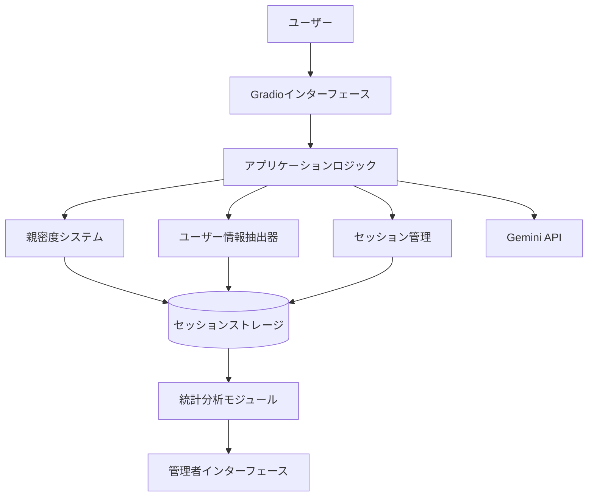

# 設計書：ユーザーエクスペリエンス強化機能

## 概要

この設計書では、麻理AIチャットアプリケーションのユーザーエクスペリエンスを向上させるための3つの主要機能の実装詳細を定義します：

1. 親密度の視覚的表示と段階変化通知
2. 重要な会話内容（ユーザー情報）の保存と活用
3. ユーザー統計情報の収集と分析

## アーキテクチャ

既存のアプリケーションアーキテクチャに新しいコンポーネントを追加します：



## コンポーネントとインターフェース

### 1. 親密度表示システム

#### 1.1 親密度ゲージコンポーネント

- **機能**: 現在の親密度レベルを視覚的に表示
- **実装**: Gradioの`gr.Slider`コンポーネントをカスタマイズ
- **更新方法**: WebSocketを使用してリアルタイム更新

#### 1.2 段階変化通知システム

- **機能**: 親密度が段階の閾値を超えたときに特別なメッセージを表示
- **実装**: 
  - 親密度の変化を監視するイベントリスナー
  - 段階変化時のアニメーションとメッセージ表示
  - 麻理のキャラクターに合った反応テキストの生成

#### 1.3 関係性ステージ詳細表示

- **機能**: 現在の関係性ステージに関する詳細情報を表示
- **実装**: アコーディオンパネル内に詳細情報を表示

### 2. ユーザー情報抽出・活用システム

#### 2.1 情報抽出モジュール

- **機能**: 会話から重要な個人情報を抽出
- **実装**: 
  - 正規表現パターンマッチング
  - キーワード検出
  - エンティティ認識
- **抽出対象情報**:
  - 名前/ニックネーム
  - 誕生日/年齢
  - 好きなもの（食べ物、趣味、アニメなど）
  - 嫌いなもの
  - 住んでいる地域（大まかな情報のみ）
  - 職業/学生情報

#### 2.2 ユーザーメタデータストレージ

- **機能**: 抽出した情報をユーザーセッションに関連付けて保存
- **実装**: 
  - JSONフォーマットでのメタデータ保存
  - セッションIDとの関連付け
  - 情報の信頼度スコアリング

#### 2.3 コンテキスト強化プロンプト生成

- **機能**: 保存された情報を会話コンテキストに組み込む
- **実装**:
  - 動的プロンプト生成時にユーザーメタデータを追加
  - 自然な形で情報を参照するためのテンプレート
  - 情報の鮮度に基づく使用頻度の調整

### 3. ユーザー統計システム

#### 3.1 データ収集モジュール

- **機能**: セッション情報と使用統計を収集
- **実装**:
  - セッション開始/終了時間の記録
  - 会話ターン数のカウント
  - ユーザーエンゲージメント指標の計算

#### 3.2 統計分析モジュール

- **機能**: 収集したデータを分析して統計情報を生成
- **実装**:
  - 日別/時間帯別のアクティブユーザー集計
  - セッション長の分析
  - 親密度の進行状況の集計

#### 3.3 管理者インターフェース

- **機能**: 統計情報を視覚的に表示
- **実装**:
  - 保護されたGradioインターフェース
  - グラフとチャートによる視覚化
  - データエクスポート機能

## データモデル

### 拡張されたUserSessionモデル

```python
class UserSession:
    user_id: str
    affection_level: int
    conversation_history: List[Dict]
    session_start_time: str
    last_interaction: str
    
    # 新しいフィールド
    user_metadata: Dict[str, Any]  # ユーザー情報を保存
    stage_transitions: List[Dict]  # 段階変化の履歴
    engagement_metrics: Dict[str, Any]  # エンゲージメント指標
```

### ユーザーメタデータモデル

```python
class UserMetadata:
    nickname: Optional[str]
    birthday: Optional[str]
    age: Optional[int]
    likes: List[Dict[str, str]]  # {category: "food", item: "ラーメン", confidence: 0.9}
    dislikes: List[Dict[str, str]]
    location: Optional[str]
    occupation: Optional[str]
    custom_fields: Dict[str, Any]  # その他のカスタムフィールド
```

### 統計データモデル

```python
class UsageStatistics:
    date: str
    unique_users: int
    total_sessions: int
    hourly_distribution: Dict[int, int]  # 時間帯別セッション数
    avg_session_duration: float
    avg_conversation_turns: float
```

## エラー処理

- **データ保存エラー**: ファイルシステムエラーが発生した場合、ログに記録し、インメモリキャッシュを使用して継続
- **情報抽出エラー**: 抽出に失敗した場合、低信頼度としてマークし、後で確認
- **統計計算エラー**: 部分的なデータでも可能な限り統計を生成し、エラー箇所を明示

## テスト戦略

1. **ユニットテスト**:
   - 情報抽出モジュールの精度テスト
   - 親密度段階変化の検出テスト
   - 統計計算の正確性テスト

2. **統合テスト**:
   - ユーザー情報の保存と会話への組み込みテスト
   - 親密度変化と通知システムの連携テスト
   - セッションデータと統計モジュールの連携テスト

3. **エンドツーエンドテスト**:
   - 完全な会話フローでの情報抽出と活用テスト
   - 長期間のセッションデータに基づく統計生成テスト

## セキュリティ考慮事項

- ユーザー情報は最小限に保持し、個人を特定できる情報は保存しない
- 統計データは匿名化して保存
- 管理者インターフェースへのアクセスは認証で保護
- すべてのデータはローカルストレージに保存し、外部サービスには送信しない